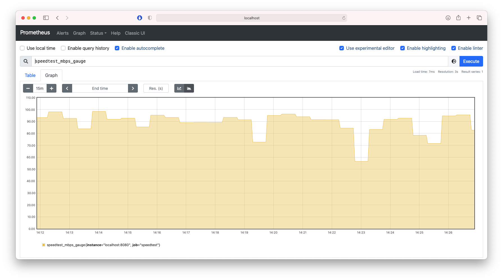

# fast-cli-prometheus-exporter

This project is a simple wrapper around the `fast-cli` tool, which measures your download speed leveraging the fast.com service provided by Netflix.

The exporter wraps the `fast-cli` binary and runs it periodically, and exposes its results in the Prometheus format.

## Prerequisites

In order to run the exporter, make sure the [`fast-cli`](https://github.com/gesquive/fast-cli) tool is [installed](https://github.com/gesquive/fast-cli#installing) and available on your PATH. Verify this easily by running it, e.g.:

```bash
pels$ fast-cli --version
fast-cli v0.2.10
```

Compiling `fast-cli-prometheus-exporter` requires [Go 1.16+](https://golang.org/dl/). 

## Usage

Building and running the exporter is as easy as:

```bash
pels$ go build -o fast-cli-prometheus-exporter cmd/fast-cli-prometheus-exporter/main.go 
pels$ ./fast-cli-prometheus-exporter
```

There are some flags to tweak the HTTP address, the interval and the distribution/histogram's bucket configuration:

```bash
pels$ ./fast-cli-prometheus-exporter -help          
Usage of ./fast-cli-prometheus-exporter:
  -addr string
    	Address to serve metrics on (default ":8080")
  -count int
    	Count of buckets in the distribution (default 60)
  -interval duration
    	Interval to run speed test at (ideally this matches the Prometheus scrape_interval) (default 30s)
  -start int
    	Value for the lowest bucket in the distribution (default 5)
  -width int
    	Width for each bucket in the distribution (default 5)
```

Here's an example for a `prometheus.yml` that scrapes these metrics (assuming `fast-cli-prometheus-exporter` is ran with default options on the same host as the Prometheus server):

```bash
scrape_configs:
  - job_name: "speedtest"
    scrape_interval: 30s
    static_configs:
      - targets: ["localhost:8080"]
```

## Example

The most interesting metrics consist of a gauge for simple graphs, e.g.:



Then, there is also a histogram where each observation represents the result of a single speedtest. The histogram allows for more advanced queries. For example, to extract the median result over the past 12 hours:

```
histogram_quantile(.5, sum by(le) (rate(speedtest_mbps_bucket[12h])))
```

Both metrics represent the download speed in Mbps.

## Credits

* Credits go to Gus Esquivel for writing the [fast-cli](https://github.com/gesquive/fast-cli) tool.
